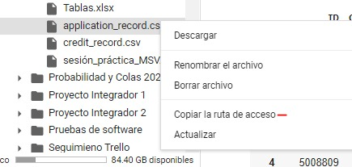

# Entregable 2: Credit Card Approval Prediction (2023)
##  Modelos y Simulación de Sistemas

### Integrantes:
- Alejandro Castrillón Ciro
- Alejandro Yarce Taborda
- Valeria Granada Rodas


La predicción de si una persona se cuenta al día en los pagos de sus tarjetas de crédito es un problema clave en la industria financiera y bancaria, debido a que esto puede influir decisión de aprobar o rechazar una solicitud de tarjeta de crédito, en esto puede afectar significativamente los ingresos y ganancias de una institución bancaria, y por lo tanto, es de vital importancia contar con modelos precisos que puedan clasificar de manera efectiva si una persona si se encuentra en mora o no se encuentra al dia en sus pagos. En los últimos años, ha habido un creciente interés en la aplicación de técnicas de aprendizaje automático para abordar este problema. Este artículo tiene como objetivo proporcionar una visión general del estado del arte en la predicción de aprobación de tarjetas de crédito, utilizando técnicas de aprendizaje automático.

## Instalación
Para instalar el proyecto debe seguir las siguientes instrucciones:

- Descargar el proyecto y llevarlo a un ambiente de Google Collab
- Una vez allí también debes descargar los dos archivos que se encuentran en la carperta content:
    - application_record.csv
    - credit_record.csv

### Alternativa 1

Luego de descargados debes subirlos a una carpeta que debes crear llamada "Modelos 2" de google drive, y pegar los dos archivos csv, y ya podrás correr el collab.

### Alternativa 2
Luego de descargarlos los archivos, subirlos en cualquier parte de tu drive, luego de ello debes correr la siguiente linea:

```bash
from google.colab import drive

drive.mount('/content/drive')
```

Allí te permitirá conectar y aceptar el acceso tu cuenta de drive en google para acceder a los archivos necesarios para la ejecución del modelo.

Después puedes dirigirte al apartado de archivos del google colab que se encuentra en el lado izquierdo con un icono de carpeta y allí dirigirse a la ubicación de los archivos que guardaste en drive.

Para copiar la ruta del archivo puede dar click derecho sobre ellos y copiar la ruta, como lo indica la siguiente imagen




Luego de identificar donde se encuentra el archivo deberá modificar las rutas en la siguiente linea:

```bash
df_application = pd.read_csv('/content/drive/MyDrive/Modelos 2/application_record.csv', sep=',')

df_credit = pd.read_csv('/content/drive/MyDrive/Modelos 2/credit_record.csv', sep=',')
```

## Ejecución
Una vez cargado los archivos puedes ejecutar cada linea en orden secuencial o simplemente indicar en el menú superior "Entorno de ejecución" > "Ejecutar todo"

